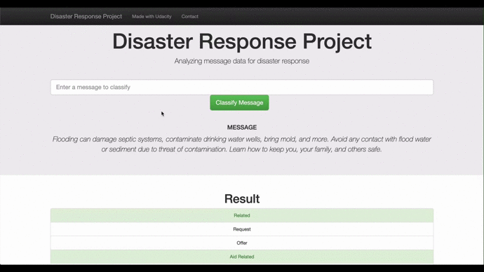

# Disaster Response Pipeline Project from Udacity Data Scientist Nanodegree

## Table of contents
- [Project Overview](#overview)
- [Project Components](#components)
  - [ETL Pipeline](#etl_pipeline)
  - [ML Pipeline](#ml_pipeline)
  - [Flask Web App](#flask)
- [Result Screenshot](#result_screenshot)
- [Folder Structure](#folder)

<a id='overview'></a>

## Project Overview:

In this project, I'll apply both data science and data engineering skills to analyze disaster data from <a href="https://www.figure-eight.com/" target="_blank">Figure Eight</a> to build a model for an API that classifies disaster messages.

First in _data_ directory, there are two csv files, _disaster_messages.csv_ and _disaster_categories.csv_, which contains real messages that were sent during disaster events. I will be doing data preprocessing including data clearning / saving data into a new created database. 

Second in _model_ directory, I will be building a NLP model including training/validating/hyperparameter tuning/testing. Then I will write this model into a pipeline to categorize these events so that appropriate disaster relief agency can be reached out for help.

Finally in _app_ directory, a web app will be built so that an emergency worker can input a new message and get classification results in several categories. The web app will also display visualizations of the data.

<a id='components'></a>

## Project Components

<a id='etl_pipeline'></a>

### 1. ETL Pipeline (_data/process_data.py_)

- Loads the messages and categories datasets
- Merges the two datasets
- Cleans the data
- Stores it in a SQLite database

<a id='ml_pipeline'></a>

### 2. ML Pipeline (_model/train_classifier.py_)

- Loads data from the SQLite database
- Splits the dataset into training and test sets
- Builds a text processing and machine learning pipeline
- Trains and tunes a model using GridSearchCV
- Outputs results on the test set
- Exports the final model as a pickle file

<a id='flask'></a>

### 3. Flask Web App
Go to directory /app, then start the web app by running the following in terminal
```bat
python run.py
```

<a id='result_screenshot'></a>

## Result Screenshot


<a id='folder'></a>

## Folder Structure
<pre>

├── app
│   ├── run.py------------------------ # FLASK FILE THAT RUNS APP
│   └── templates
│       ├── go.html------------------- # WEB APP CLASSIFICATION RESULT PAGE
│       └── master.html--------------- # WEB APP MAIN PAGE
├── data
│   ├── DisasterResponse.db----------- # DATABASE WITH SAVED CLEANED DATA
│   ├── disaster_categories.csv------- # DATA OF DISASTER CATEGORIES
│   ├── disaster_messages.csv--------- # DATA OF DISASTER MESSAGES
│   └── process_data.py--------------- # PYTHON SCRIPT FOR ETL PIPELINE (DATA PREPROCESSING)
├── models
│   └── train_classifier.py----------- # PYTHON SCRIPT FOR ML PIPELINE (MODEL BUILDING)
├── screenshots----------------------- # SCREENSHOTS FOR WEB APP DEMO

</pre>


